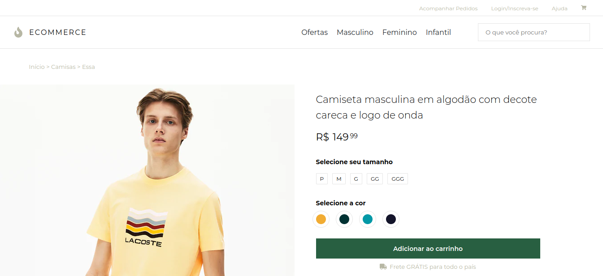
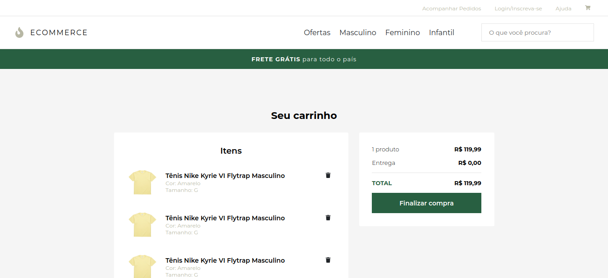

# 🛒 eCommerce






# 📑 Table of Contents

- [🛒 eCommerce](#-ecommerce)
- [📑 Table of Contents](#-table-of-contents)
- [📦 About](#-about)
- [📋 Features](#-features)
- [⚙️ Technologies](#️-technologies)
- [📥 Installation](#-installation)
- [🏁 Gettin Started](#-gettin-started)


# 📦 About

This is an ecommerce web app using *ReactJS* for practice my developer skills.
I have no right for images or products used in this project. All the images have a links for the origin website.

The design is inspired on [Nike](https://www.nike.com/) and [Lacoste](https://www.lacoste.com/br) ecommerce pages.


# 📋 Features

- 🔎 Search by specific products
- 🛍️ Filter products by category, color, brand...
- 👥 Login and logout
- 🛒 Add and remove products
- 💸 Calc the total price of the cart


# ⚙️ Technologies

- ReactJS
- Typescript
- Styled Components
- React Icons / Font Awesome
- React Router Dom

**Obs: At this moment, just the front-end is done.**


# 📥 Installation

**You will need [Yarn](https://yarnpkg.com/lang/pt-BR/docs/install/) or [NPM](https://www.npmjs.com/get-npm) to start the installation**

Clone this repository using:

```git clone https://github.com/Pedrofiigueiredo/eeecommerce```

Access the directory of the cloned repository.

```cd eeecomerce```

Install the dependencies with

```yarn install```

*You can also use ```npm install```*


# 🏁 Gettin Started

Run ```yarn start```. The project will be open in your browser and run on 3000 port.

*You can also run ```npm start``` to initialize the project*